# DhanSetu — Complete Process Flows & System Documentation

> This document explains every process in the DhanSetu platform end-to-end, with detailed flowcharts using Mermaid syntax. Render in GitHub, VS Code (Markdown Preview Enhanced), or any Mermaid-compatible viewer.

---

## Table of Contents

1. [High-Level System Flow](#1-high-level-system-flow)
2. [Vendor Registration Process](#2-vendor-registration-process)
3. [Lender Registration Process](#3-lender-registration-process)
4. [Login & Authentication Flow](#4-login--authentication-flow)
5. [Email OTP Verification Flow](#5-email-otp-verification-flow)
6. [Password Reset Flow](#6-password-reset-flow)
7. [Two-Factor Authentication (2FA) Setup](#7-two-factor-authentication-2fa-setup)
8. [Loan Application Process](#8-loan-application-process)
9. [Loan Approval / Rejection Process](#9-loan-approval--rejection-process)
10. [Loan Repayment Process](#10-loan-repayment-process)
11. [KYC Encryption & Decryption Flow](#11-kyc-encryption--decryption-flow)
12. [Blockchain Smart Contract Lifecycle](#12-blockchain-smart-contract-lifecycle)
13. [Oracle Sales Data Flow](#13-oracle-sales-data-flow)
14. [JWT Authorization Flow](#14-jwt-authorization-flow)
15. [Frontend Routing & Protected Routes](#15-frontend-routing--protected-routes)
16. [Data Flow Diagram — Full System](#16-data-flow-diagram--full-system)
17. [State Machines](#17-state-machines)
18. [Database Entity Relationships](#18-database-entity-relationships)
19. [Component Architecture (Frontend)](#19-component-architecture-frontend)
20. [Deployment Pipeline](#20-deployment-pipeline)

---

## 1. High-Level System Flow

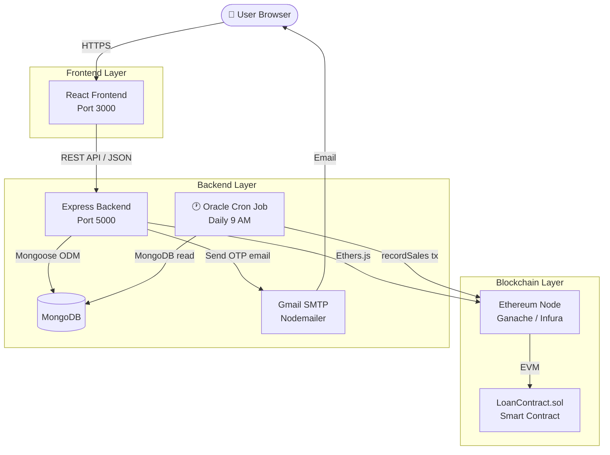

---

## 2. Vendor Registration Process

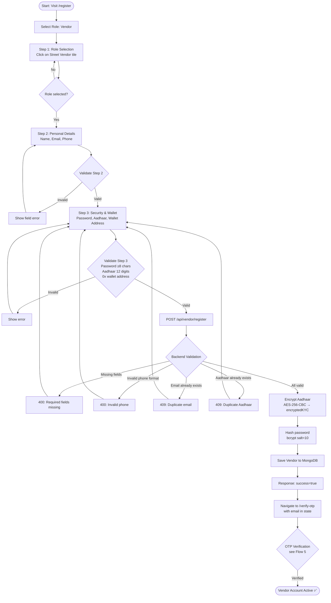

---

## 3. Lender Registration Process

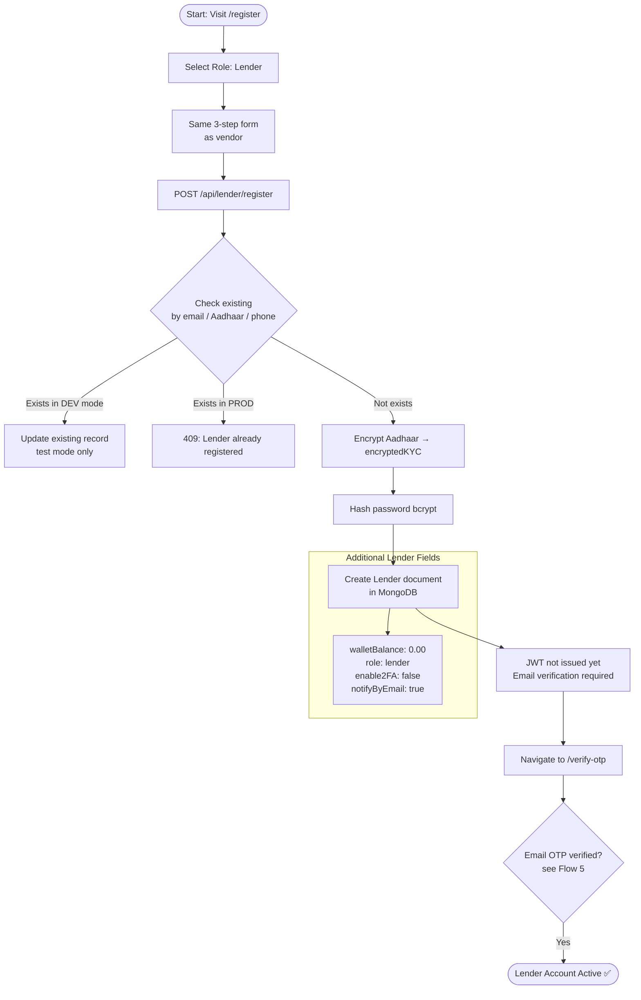

---

## 4. Login & Authentication Flow

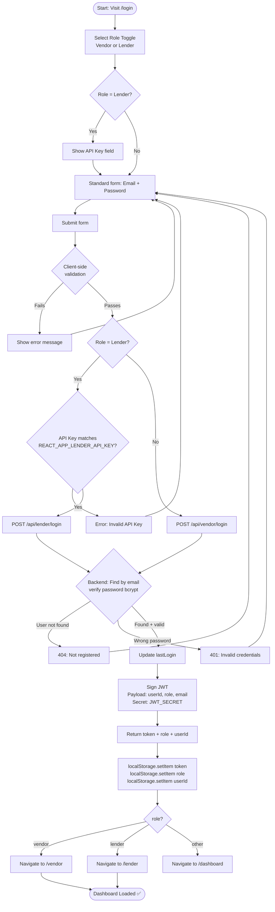

---

## 5. Email OTP Verification Flow

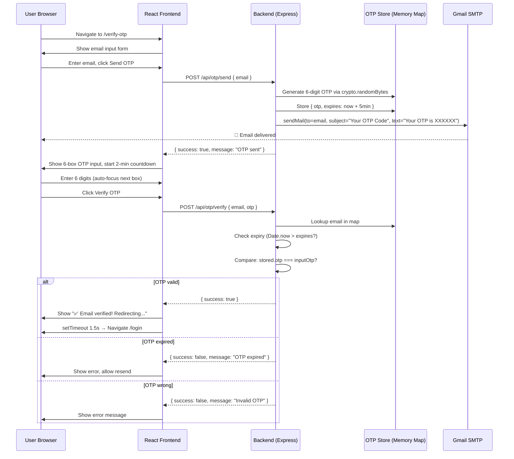

---

## 6. Password Reset Flow

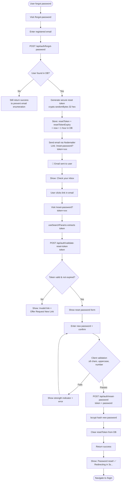

---

## 7. Two-Factor Authentication (2FA) Setup

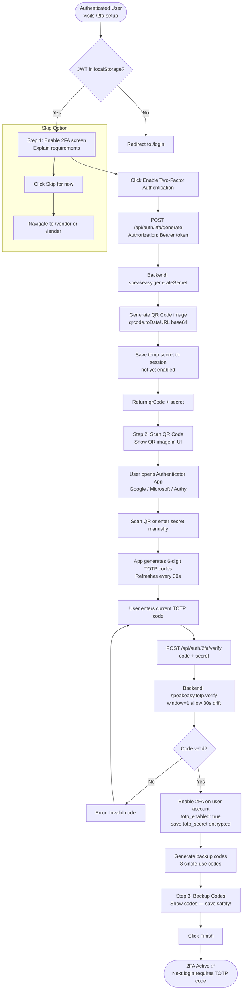

---

## 8. Loan Application Process

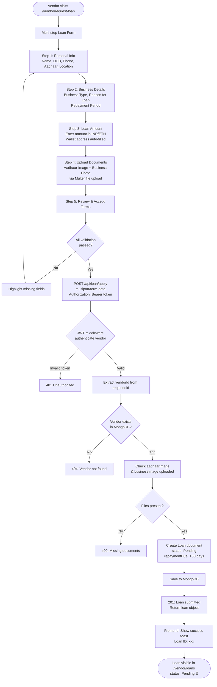

---

## 9. Loan Approval / Rejection Process

```mermaid
flowchart TD
    A([Lender visits /lender/loans]) --> B[GET /api/lender/all-loans\nAuthorization: Bearer token]
    B --> C{requireLender middleware\nchecks role === lender}
    C -- Fails --> D[403 Forbidden]
    C -- Passes --> E[Fetch all loans from MongoDB\nstatus: Pending first]
    E --> F[Render loan cards with\nVendor details, amount,\ndocument previews, reason]

    F --> G{Lender reviews\nloan request}
    G --> H[View Aadhaar image\n& Business photo]
    H --> I{Decision}

    I -- Approve --> J[PUT /api/lender/loans/:loanId/approve]
    J --> K[Backend: Find loan by ID]
    K --> L{Loan is Pending?}
    L -- No --> M[400: Already processed]
    L -- Yes --> N[Update Loan:\nstatus → Approved\nlenderId → this lender\napprovedAt → now]
    N --> O[Create Transaction record\ntype: Approval]
    O --> P[Blockchain interaction\ncontract.approveLoan loanId, vendorAddress]
    P --> Q[Store txHash in loan document]
    Q --> R[200: Loan approved ✅]
    R --> S[Vendor notified on next\ndashboard visit]

    I -- Reject --> T[PUT /api/lender/loans/:loanId/reject]
    T --> U[Update Loan:\nstatus → Rejected]
    U --> V[200: Loan rejected ❌]

    subgraph Vendor sees result
        S --> W[/vendor/loans → status: Approved ✅]
        V --> X[/vendor/loans → status: Rejected ❌]
    end
```

---

## 10. Loan Repayment Process

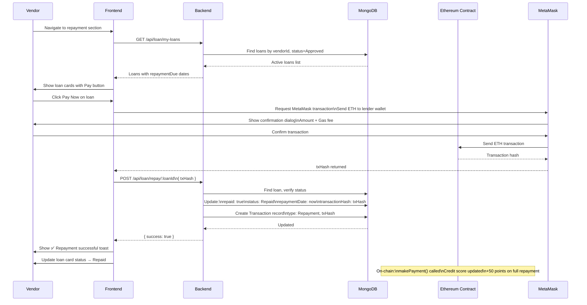

---

## 11. KYC Encryption & Decryption Flow

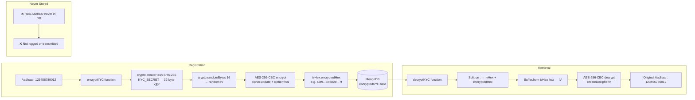

---

## 12. Blockchain Smart Contract Lifecycle

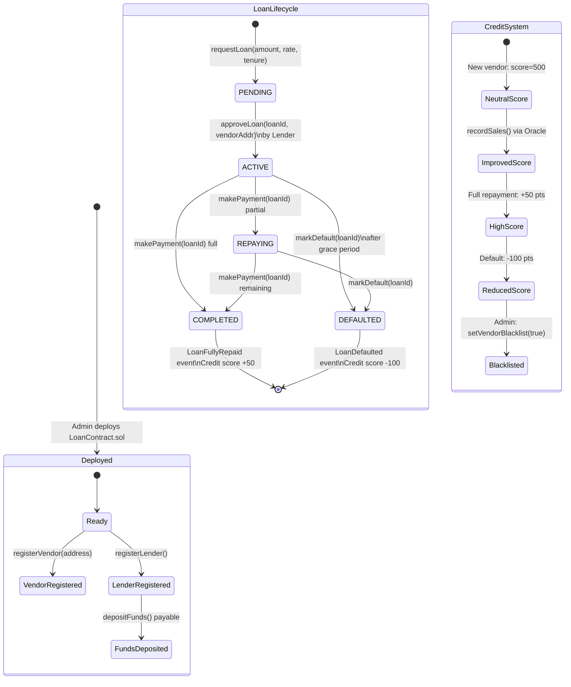

---

## 13. Oracle Sales Data Flow

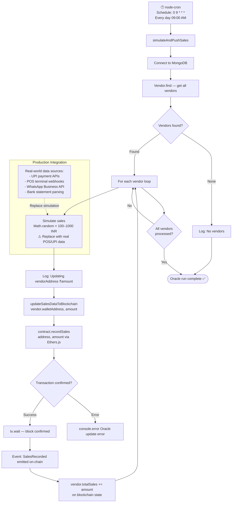

---

## 14. JWT Authorization Flow

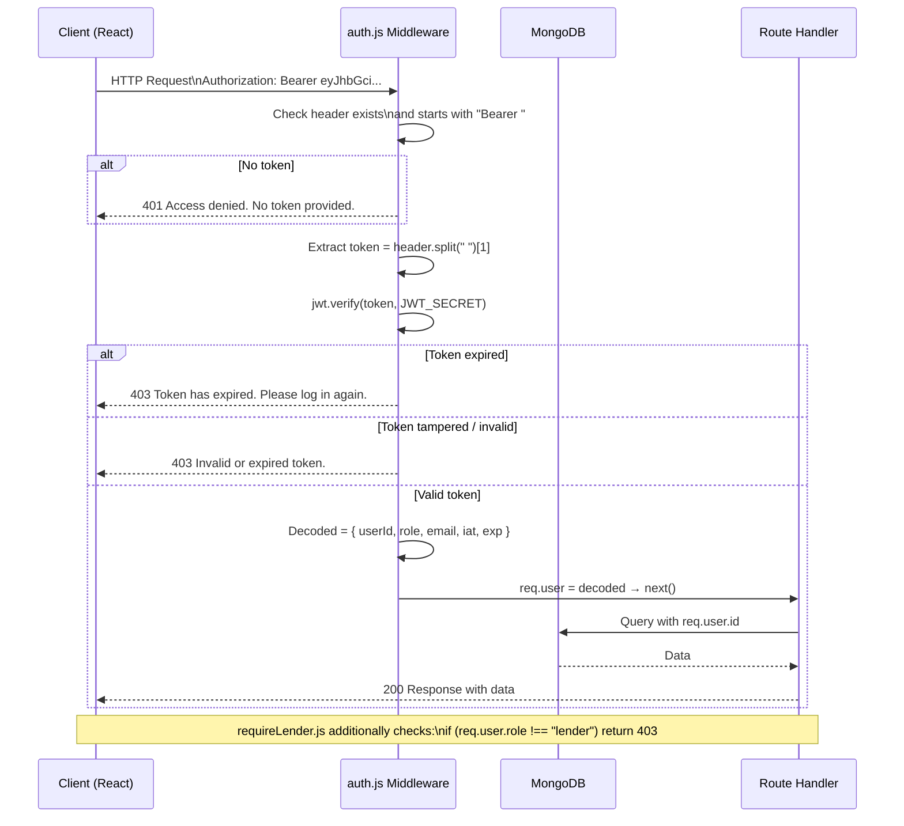

---

## 15. Frontend Routing & Protected Routes

```mermaid
flowchart TD
    A([Browser navigates to URL]) --> B{Is path public?}
    
    B -- / or /login or /register\nor /verify-otp etc. --> C[Render public component directly]
    
    B -- /vendor/* or /lender/* --> D[ProtectedRoute component]
    D --> E{localStorage.getItem token?}
    E -- null or empty --> F[Redirect to /login]
    E -- Has token --> G{localStorage.getItem role\n=== requiredRole prop?}
    G -- Mismatch --> H[Redirect to /login\nwrong role]
    G -- Match --> I[Render DashboardLayout]

    I --> J[DashboardLayout mounts]
    J --> K[Read role from localStorage]
    K --> L{role?}
    L -- vendor --> M[Show vendor nav links\nApply vendor-modern-scope CSS]
    L -- lender --> N[Show lender nav links\nApply lender-modern-scope CSS]
    L -- null --> O[Show generic layout]

    M --> P[Render Outlet\n= matched child route]
    N --> P
    P --> Q[Child page component renders]
    Q --> R[QuickAccessDock: role-aware shortcuts]
    Q --> S[Footer renders]

    subgraph Route Definitions in App.js
        T1[/vendor → VendorDashboard index]
        T2[/vendor/loans → VendorLoans]
        T3[/vendor/request-loan → LoanRequestForm]
        T4[... 12 more vendor routes]
        T5[/lender → LenderDashboard index]
        T6[/lender/loans → LenderLoans]
        T7[... 11 more lender routes]
    end
```

---

## 16. Data Flow Diagram — Full System

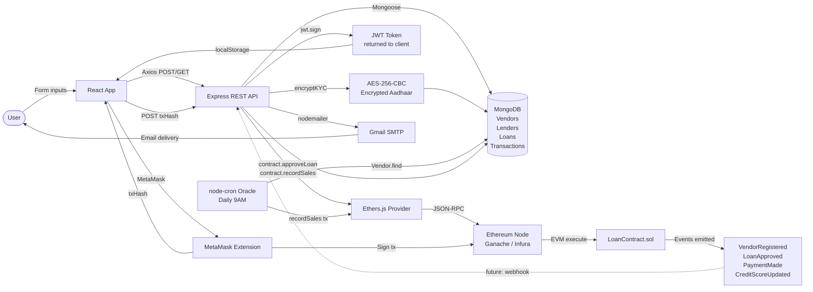

---

## 17. State Machines

### Loan Document State Machine

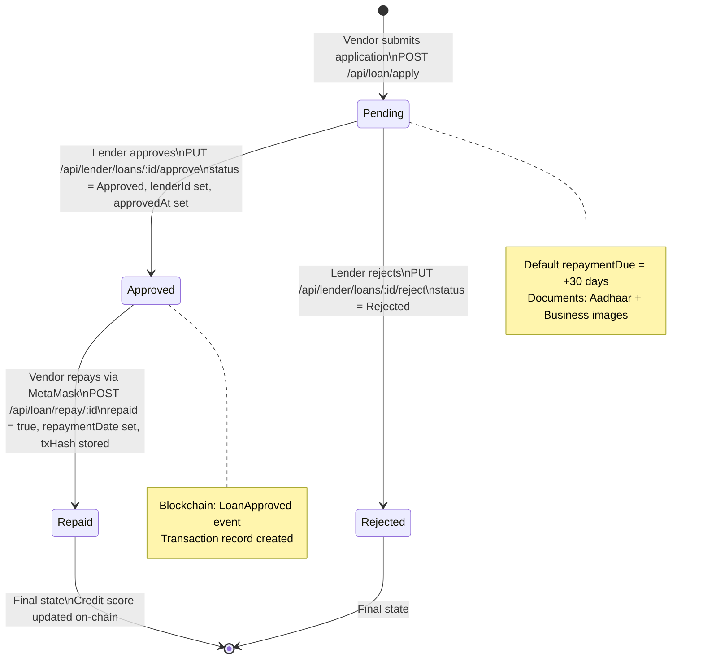

### Vendor Onboarding State Machine

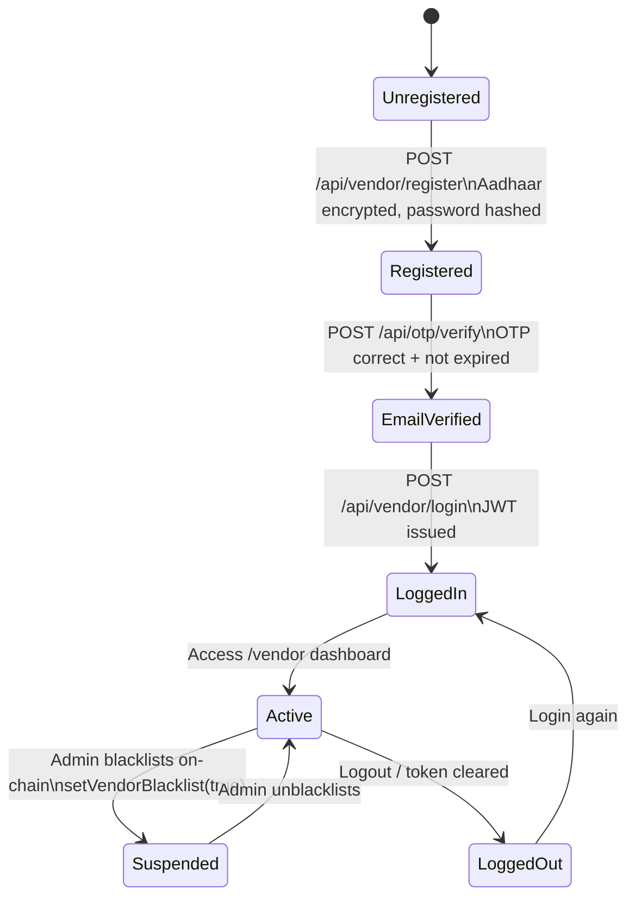

---

## 18. Database Entity Relationships

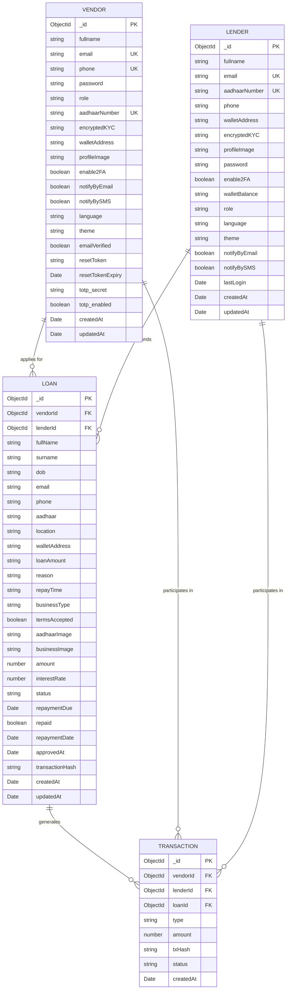

---

## 19. Component Architecture (Frontend)

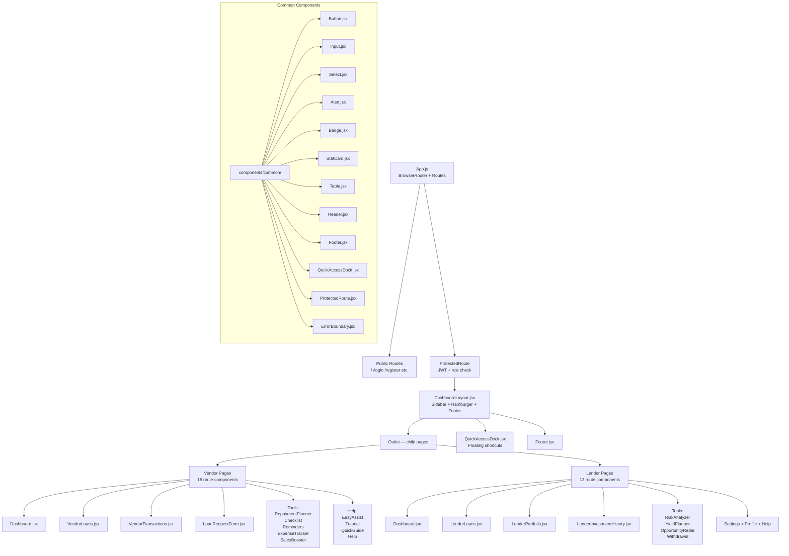

---

## 20. Deployment Pipeline

```mermaid
flowchart TD
    subgraph Development
        DEV1[Developer writes code] --> DEV2[npm run dev\nbackend nodemon]
        DEV2 --> DEV3[npm start\nReact dev server port 3000]
        DEV3 --> DEV4[Ganache local blockchain\nport 7545]
        DEV4 --> DEV5[node oracles/salesOracleSimulator.js]
    end

    subgraph Build & Test
        DEV5 --> B1[npm test — React + Hardhat tests]
        B1 --> B2[npm run build\nCreate React App production bundle]
        B2 --> B3{Build success?\nno errors}
        B3 -- Fail --> DEV1
        B3 -- Pass --> DEPLOY
    end

    subgraph DEPLOY[Deployment]
        direction TB
        F1[Frontend\nbuild/ folder] -->|Upload| VERCEL[Vercel / Netlify\nStatic CDN]
        
        BK1[Backend\nNode.js app] -->|Deploy| RAILWAY[Railway / Render\nor EC2 with PM2]
        
        SC1[Smart Contract] -->|npx hardhat run deploy.js\n--network sepolia| INFURA[Infura / Alchemy\nSepolia Testnet]
        
        INFURA -->|Contract Address| ENV[Update .env\nCONTRACT_ADDRESS=0x...]
        ENV --> RAILWAY
        
        RAILWAY -->|CORS allow| VERCEL
    end

    subgraph Environment Variables
        ENV2[Root .env:\nPORT, MONGO_URI, JWT_SECRET\nKYC_SECRET, OTP_EMAIL/PASS\nINFURA_API, PRIVATE_KEY\nCONTRACT_ADDRESS, FRONTEND_URL]
        ENV3[Frontend .env:\nREACT_APP_LENDER_API_KEY\nREACT_APP_API_URL]
    end
```

---

## Process Summary Table

| # | Process | Trigger | Key Steps | Output |
|---|---|---|---|---|
| 1 | Vendor Registration | `/register` form submit | Validate → Encrypt KYC → Hash PW → Save MongoDB | Vendor account created |
| 2 | Lender Registration | `/register` (lender role) | Same as vendor + API key required at login | Lender account created |
| 3 | Login | `/login` form submit | Validate → Find user → Compare bcrypt → Sign JWT | JWT token in localStorage |
| 4 | OTP Verification | After registration | Generate OTP → Send email → Verify → Activate account | Email verified |
| 5 | Password Reset | `/forgot-password` | Generate token → Email link → Validate token → Hash new PW | Password updated |
| 6 | 2FA Setup | `/2fa-setup` | Generate TOTP secret → QR code → Verify code → Enable | 2FA active |
| 7 | Loan Application | `/vendor/request-loan` | Fill form → Upload docs → POST to API → Status=Pending | Loan in MongoDB |
| 8 | Loan Approval | Lender dashboard | Review loan → PUT approve → Blockchain tx → Status=Approved | Loan funded on-chain |
| 9 | Loan Repayment | Vendor dashboard | MetaMask tx → POST txHash → Status=Repaid → Credit score++ | Loan closed |
| 10 | Oracle Sync | Daily 9 AM cron | Read vendors from DB → Simulate sales → recordSales() on-chain | Sales updated on blockchain |
| 11 | KYC Encrypt | Registration | AES-256-CBC → iv:ciphertext → MongoDB | Aadhaar never in plaintext |
| 12 | JWT Auth | Every protected request | Extract Bearer token → jwt.verify → req.user = decoded | Access granted or 401/403 |

---

*All flowcharts use [Mermaid](https://mermaid.js.org/) syntax. View on GitHub, VS Code with the Markdown Preview Mermaid Support extension, or at [mermaid.live](https://mermaid.live).*
